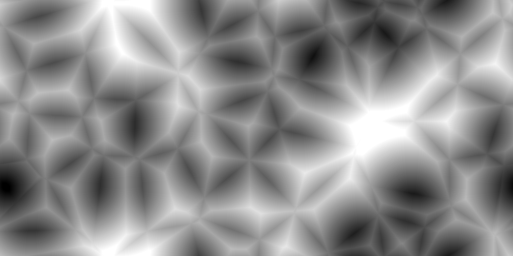
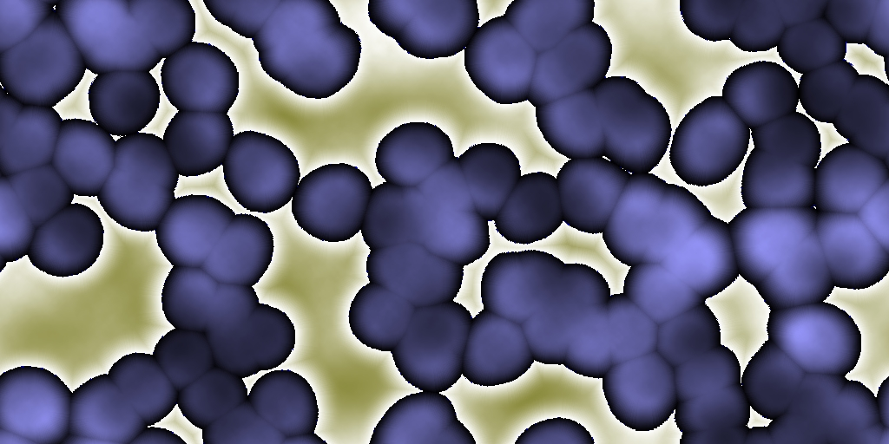
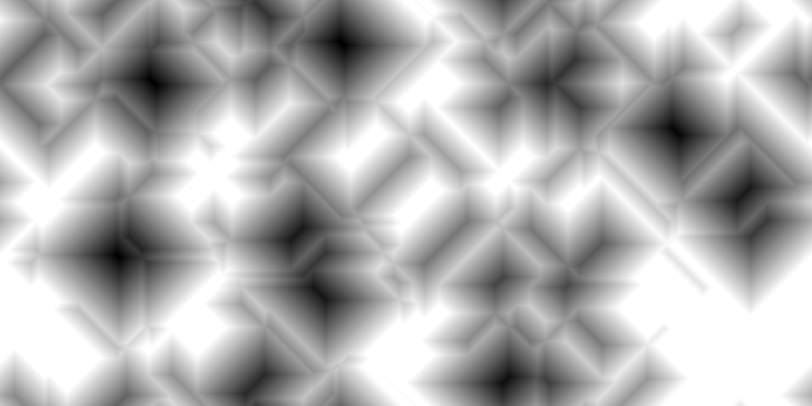
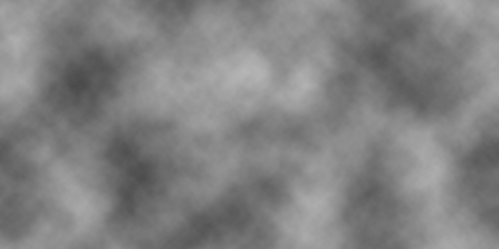
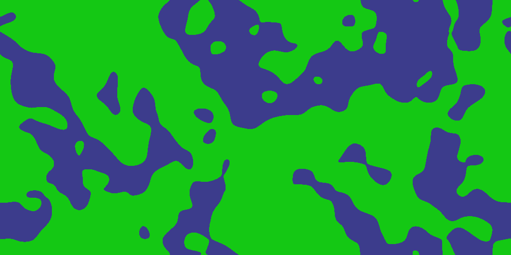

ccNoise
=======

ccNoise is a lightweight coherent noise library, which can be used to render and combine:
- White noise
- Value noise
- Worley noise
- Perlin noise

The following libraries are required to build ccNoise:
- [ccRandom](https://github.com/jobtalle/ccRandom)
- [ccTrigonometry](https://github.com/jobtalle/ccTrigonometry)

Examples:

